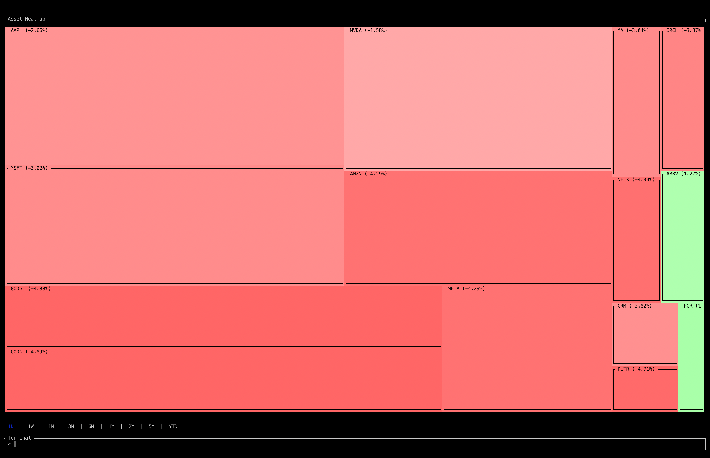

# Terminal Asset Heatmap

An asset heatmap for your terminal.

Built with Rust using [ratatui](https://crates.io/crates/ratatui/0.23.0) and [yahoo finance data](https://crates.io/crates/yahoo_finance_api).



## Terminal Commands

```
ADD <ticker>          Add an asset to the heatmap
REMOVE <ticker>       Remove an asset from the heatmap
INTERVAL <interval>   Update the time interval used for price data
UPDATE                Refetch price data for each asset
EXIT                  Exit the program
```

## Usage

```console
cargo run --release
```
